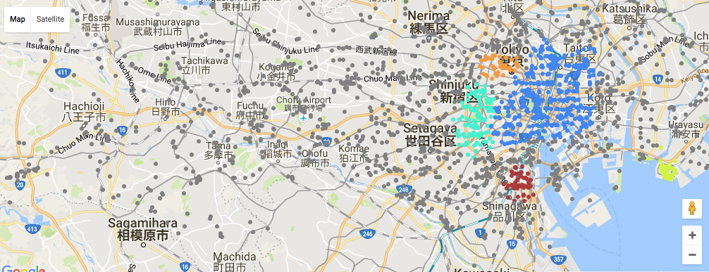

# TokyoGo 

#### A Sample Data Science project 

#### Introduction & Data Source:
The 2-week long capstone proejct was developed to fulfill the requirement of Galvanize data science immersive program. The object of this project was to explore city attractions in Tokyo and make recommendations for travellers, Data were obtained using [Foursquare](https://foursquare.com/) API and web srcaping tools (Selenium package with python). 

#### __Goal__: 
Build a city attraction recommender system based on web-scraping data; Test is we can summarize tourists' intention toward an attraction using the review and photos they posted on phone/web app.

#### Method:

**Figure 1: Workflow**

1. Explore the data with mongodb query to understand the content, range, and quality of data.
  - terminology: 
       - venues: city attractions;
       - tip: user review on the venue or suggestion made to other visitors;
   - Venue statistics indicates older tips were removed from Foursquare's database 
   - Mixed language could be challenging in NLP processing    
2. Filter out venues which are restaurants or train stations (except for some famous travel attractions) 
3. Use DBScan algorithm to group locaitons with different "spatial density": downtown area has highest ddensity and can be explore in short-term trip, and often with limited types of activities.

**Figure 2: DBScan result: downtown area has highest density of venues and mixed categories, except for large theme park (e.g. Disneyland, Sea Park, and etc.) and mountain trails**

4. A baseline model was built with features realted to popularity (how many vistis, percentage "liked", percentage checkins with photos and/or tips posted) of all venues.
5. Use google geocoding api and translate api to group user homecity data to tokyoer, janpanese, and foreigner. 

**Figure 3: Location of top 200 popular venues of each tourist source groups**

**Figure 4: Counts of top 200 popular venues of each tourist source groups**

6. Comparison among reivews from different visitor sources were performed to refine the recommendation: 
  1) popular keywords were all translated to English,
  2) For each venue, the keywords were formated into a vector with length equal to total counts of keywords in the entire dateset. 
     If a keyword appears in a venue's document, the value was assigned to one; otherwise 0
  3) Non-negative matrix factorization was applied on the aforementioned keywords vectors to group the venues to 5 different tops
  4) Manually adjusted topics of the venues.
 
7. A pesudo user-item evaluation score matrix was generated with each visitor's action on ecah venues's page (namely "likes", "photos posted", and "tips posted"), and use graphlab's factorization recommender model to make a list of recommended venes.
8. Weighted the score predicted by the aforementioned model by the topics and homecity group, and return the top few venues. 
9. UI developemnt: Let user pick photos they are interested and also their homecity group, plot recommendation attractions on map. 

#### Limitations: 
- Used a small portion of the text data due to translation cost and timelimit; 
- Tested tesnsorflow on Spark EMR for image content tagging, the result was not relevent to this recommender system, but could be a side project afterward. 
- The project relied on geo-tagged data of foursquare website, which is not a popular app in the most contries. Therefore, Tokyo was chosen as my target area. 

#### Dicussion: 
- The method applied was able to distinguish (to a certain extent) preferences of different groups (local, visitors from other areas in Japan, and foreign travelers).

- My recommender system product of this project will include only the top 200 venues of each visitor source group (sum up to 442 venues) as an toy example that can be deployed on a small amazon instance. The framework can be extended when more data available, and he business features and A/B testing evaluation can be added.

- The NMF analysis indicates visitors to all the venues tend to mention some food, which also indicates that food is an important element that shared among all city attractions! Restaurant recommender is not the topic of this project, but I am expecting to see interesting patterns among different tourist sources in Tokyo.
